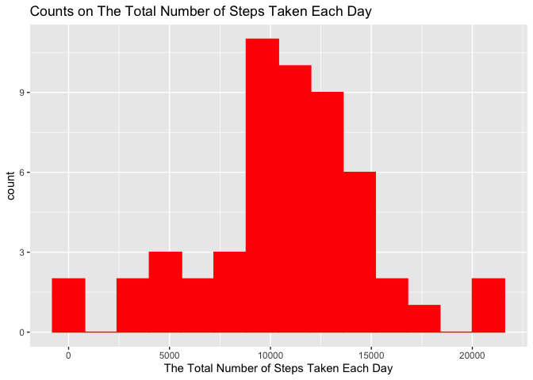
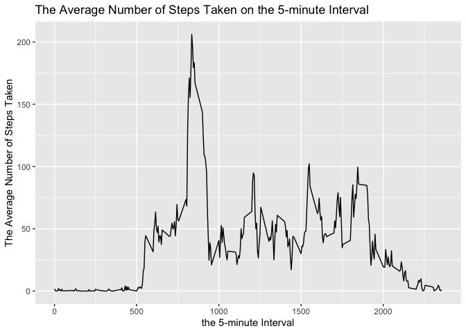
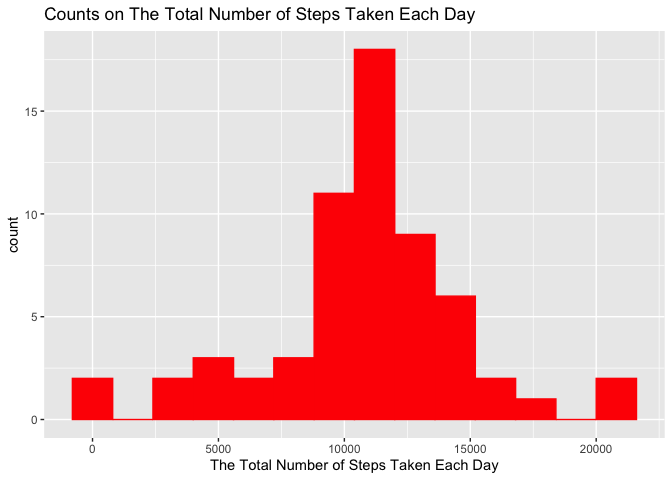
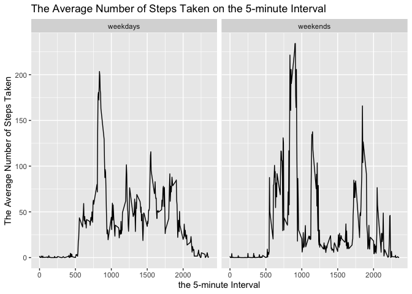

## Loading and preprocessing the data

```r
activity <- read.csv("activity.csv")
```


```r
library(dplyr)
```

```
## 
## Attaching package: 'dplyr'
```

```
## The following objects are masked from 'package:stats':
## 
##     filter, lag
```

```
## The following objects are masked from 'package:base':
## 
##     intersect, setdiff, setequal, union
```

```r
library(ggplot2)
```

- check the class of activity

```r
str(activity)
```

```
## 'data.frame':	17568 obs. of  3 variables:
##  $ steps   : int  NA NA NA NA NA NA NA NA NA NA ...
##  $ date    : Factor w/ 61 levels "2012-10-01","2012-10-02",..: 1 1 1 1 1 1 1 1 1 1 ...
##  $ interval: int  0 5 10 15 20 25 30 35 40 45 ...
```
convert activiy of date to date class

```r
activity$date <- as.Date(as.character(activity$date), "%Y-%m-%d")
str(activity)
```

```
## 'data.frame':	17568 obs. of  3 variables:
##  $ steps   : int  NA NA NA NA NA NA NA NA NA NA ...
##  $ date    : Date, format: "2012-10-01" "2012-10-01" ...
##  $ interval: int  0 5 10 15 20 25 30 35 40 45 ...
```


## What is mean total number of steps taken per day?
1. Calculate the total number of steps for each day


```r
act_summary <- activity %>% filter(!is.na(steps)) %>% group_by(date) %>% summarise(stotal= sum(steps))
head(act_summary)
```

```
## # A tibble: 6 x 2
##   date       stotal
##   <date>      <int>
## 1 2012-10-02    126
## 2 2012-10-03  11352
## 3 2012-10-04  12116
## 4 2012-10-05  13294
## 5 2012-10-06  15420
## 6 2012-10-07  11015
```
2. histogram of total steps teken each day using ggplot


```r
ggplot(act_summary, aes(x = stotal)) + 
        geom_histogram(fill="red", color="red", binwidth = 1600)+
        xlab("The Total Number of Steps Taken Each Day") +
        ggtitle("Counts on The Total Number of Steps Taken Each Day")
```

<!-- -->
  
3.Calculation of mean and median of total steps


```r
mean(act_summary$stotal)
```

```
## [1] 10766.19
```

```r
median(act_summary$stotal)
```

```
## [1] 10765
```


## What is the average daily activity pattern?
First I defined new data frame


```r
intervals <- activity %>% filter(!is.na(steps)) %>% group_by(interval) %>%
        summarise(smean = mean(steps)) %>%
        mutate(interval = as.integer(interval))
head(intervals)
```

```
## # A tibble: 6 x 2
##   interval  smean
##      <int>  <dbl>
## 1        0 1.72  
## 2        5 0.340 
## 3       10 0.132 
## 4       15 0.151 
## 5       20 0.0755
## 6       25 2.09
```
Now let draw the graph

```r
ggplot(intervals, aes(x = interval , y = smean)) + 
        geom_line() +
        ylab("The Average Number of Steps Taken") + 
        xlab("the 5-minute Interval") +
        ggtitle("The Average Number of Steps Taken on the 5-minute Interval") 
```

<!-- -->
  
And Calculate max mean and then find row contain the max value


```r
maxinterval <- intervals[intervals$smean==max(intervals$smean),]
maxinterval[,1]
```

```
## # A tibble: 1 x 1
##   interval
##      <int>
## 1      835
```


## Imputing missing values

1. Calculate an show the number of missing steps data

```r
missingnumber <-activity %>%
        filter(is.na(steps)) %>%
        summarise(tmdata = length(steps))
missingnumber
```

```
##   tmdata
## 1   2304
```
Activity data set contains 2304 missing data and its raio is %13.11

2. in average activity pattern I calculate mean for each 5-min interval so that Let's define new_activity data which replace NA with mean of same interval.

```r
new_activity <- activity
for (i in 1:length(new_activity$steps)) {
        if (is.na(new_activity$steps[i])) {
                new_activity$steps[i] <- intervals[which(new_activity$interval[i]==intervals$interval),]$smean
        }
        else {new_activity$steps[i] <- new_activity$steps[i]
        }
}
head(new_activity)
```

```
##       steps       date interval
## 1 1.7169811 2012-10-01        0
## 2 0.3396226 2012-10-01        5
## 3 0.1320755 2012-10-01       10
## 4 0.1509434 2012-10-01       15
## 5 0.0754717 2012-10-01       20
## 6 2.0943396 2012-10-01       25
```
3. calculate Total steps for each day and graph

```r
new_act_summary <-new_activity %>% group_by(date) %>% summarise(stotal= sum(steps))
ggplot(new_act_summary, aes(x = stotal)) + 
        geom_histogram(fill="red", color="red", binwidth = 1600)+
        xlab("The Total Number of Steps Taken Each Day") +
        ggtitle("Counts on The Total Number of Steps Taken Each Day")
```

<!-- -->

```r
mean(new_act_summary$stotal, na.rm = TRUE)
```

```
## [1] 10766.19
```

```r
median(new_act_summary$stotal, na.rm = TRUE)
```

```
## [1] 10766.19
```

4. compare mean and median of activity data with NA and activity data without NA

```r
cmprt <- data.frame (mean= c(mean(act_summary$stotal, na.rm = TRUE), mean(new_act_summary$stotal, na.rm = TRUE)), median= c(median(act_summary$stotal, na.rm = TRUE),median(new_act_summary$stotal, na.rm = TRUE)))
row.names(cmprt) <- c("activity_withNA", "activity_withoutNA")
cmprt
```

```
##                        mean   median
## activity_withNA    10766.19 10765.00
## activity_withoutNA 10766.19 10766.19
```
As it can be seen that mean of each data frame is same, change in median is only % 0.011

## Are there differences in activity patterns between weekdays and weekends?
lubricate package is need

```r
library(lubridate)
```

```
## 
## Attaching package: 'lubridate'
```

```
## The following object is masked from 'package:base':
## 
##     date
```
Now add new wariable weekend dor new_activitiy c


```r
for (i in 1:nrow(new_activity)) {
       if (as.POSIXlt(new_activity$date)$wday[i]==7 | as.POSIXlt(new_activity$date)$wday[i]==1){
               new_activity$weekends[i]= "weekends"
       } 
        else {
                new_activity$weekends[i]= "weekdays"
        }
}
head(new_activity)
```

```
##       steps       date interval weekends
## 1 1.7169811 2012-10-01        0 weekends
## 2 0.3396226 2012-10-01        5 weekends
## 3 0.1320755 2012-10-01       10 weekends
## 4 0.1509434 2012-10-01       15 weekends
## 5 0.0754717 2012-10-01       20 weekends
## 6 2.0943396 2012-10-01       25 weekends
```

```r
table(new_activity$weekend)
```

```
## 
## weekdays weekends 
##    14976     2592
```
  
Now subset new variable an calculate mean for each interval

```r
weekdata <- new_activity %>%
        group_by(weekends, interval) %>%
        summarise(smean = mean(steps))
```
  
Now lets graphs

```r
ggplot(weekdata, aes(x = interval , y = smean)) + 
        geom_line() +
        facet_wrap(~weekends) +
        ylab("The Average Number of Steps Taken") + 
        xlab("the 5-minute Interval") +
        ggtitle("The Average Number of Steps Taken on the 5-minute Interval") 
```

<!-- -->
